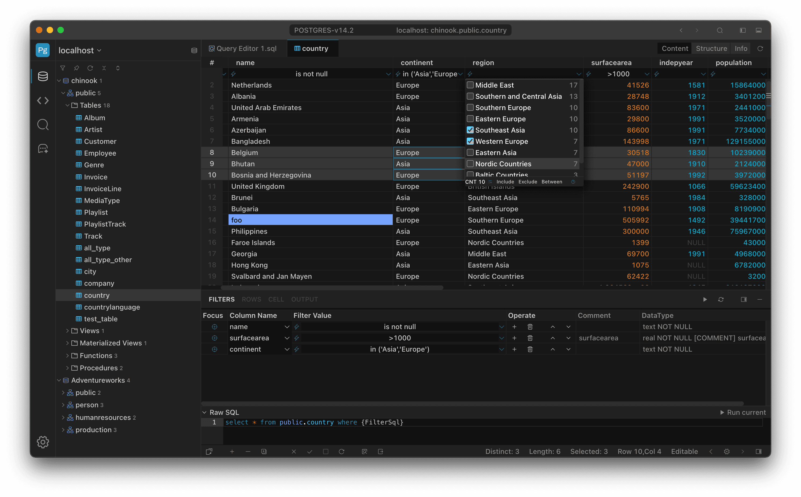

  

  <h1>SteelSQL</h1>
  

    
Reinventing the way you interact with data.

    
    <h3 align="center">This repository is currently being used for hosting the official issue & bug tracker  </h3>
    

<!-- 

<a href="https://#">documents</a>

  -->

 

<h2>SteelSQL</h2>

<h3>
SteelSQL is free and has no limit on trial time
We would be thrilled if you purchased a license to support development!
</h3>

<a href="https://steelsql.com" target="_blank">    
<!--  -->
Download
</a> 

SteelSQL is a cross-platform database management tool supporting macOS, Windows, and Linux. Whether you are a seasoned database administrator or a developer, SteelSQL streamlines your database operations and enhances productivity.

SteelSQL is the most advanced database management solution designed to meet the needs of developers, data professionals, and organizations striving for seamless data operations. Combining powerful features with an intuitive interface, it is ideal for managing any database environment.

Say goodbye to complexity and embrace efficiency! SteelSQL is a database management tool for the modern developer, combining powerful features with an elegant design to help you navigate the ocean of data with ease.

SteelSQL is built using Electron technology, but it strictly controls memory usage, resulting in low memory consumption.

### Why SteelSQL?

1. **Multiple Databases Support**: Whether you are using MySQL/MariaDB, PostgreSQL, Oracle, Sqlite, or SQL Server, SteelSQL simplifies connectivity between multiple database systems. Say goodbye to compatibility issues and use a unified interface for all your data needs!

2. **AI-Powered Natural Language Query**: Integrated with AI chat interface, enabling database queries through natural language (AI Chat to DB). The system automatically parses semantics and generates corresponding SQL, lowering the barrier to data querying and improving data access efficiency for non-technical users.

3. **Efficient Data Filtering**: Provide unprecedented data filtering methods, which can greatly improve the filtering efficiency and user experience, grouping filtering like Excel to edit data, and provide perfect customization support to adapt to a variety of complex database requirements.

4. **Intelligent Code Completion**: Writing complex queries has never been easier with SteelSQL's intelligent code completion, SQL formatting and syntax highlighting features. Our advanced SQL editor increases your productivity and lets you focus on creating the best queries without the hassle.

5. **Visual Database Design**: Create and modify database structures effortlessly with our intuitive visual design tools. Supports column, indexex, unique, check, foreignKey editing.

6. **Comprehensive Data Management**: Easily browse, edit and visualize data. With support for cell multi-selection, editing, copying and pasting, SteelSQL allows you to perform batch updates, manage databases, and import/export data with just a few clicks, streamlining your workflow like never before.

7. **Multi-Format Data Import/Export**: Supports exporting query results or entire tables to multiple formats including Xlsx, CSV, JSON, Xml and Insert SQL. Built-in data import engine supports batch data migration, incremental updates, and automatic format conversion to meet data backup and exchange requirements.

8. **Highly Customizable**: Support theme switching, icon colors, SQL editor customization settings, shortcut key definitions for almost all functions, data colors, etc. to create your own database management environment.

### **Experience the Advantages of SteelSQL**

SteelSQL is designed to enhance your database management experience. No more struggling with cumbersome interfaces and complex workflows. Whether you're an experienced database administrator or just starting out, SteelSQL gives you the tools you need to work smarter.

### **Try SteelSQL today!**

Ready to elevate your database management? Experience the power, flexibility and efficiency of SteelSQL. Sign up for a free trial and learn how SteelSQL can change your data management journey and enable you to achieve more than ever before. Let's build the future of data together! <a href="https://steelsql.com" target="_blank">    
Download
</a> 

## Information Collection and Use

Only necessary information is collected and will not be provided to third parties. For details, please refer to

[Privacy Policy](https://steelsql.com/policy)

[Terms of Use](https://steelsql.com/legal)

## Contact

For support and inquiries, please contact us at [biz@steelsql.com](mailto:biz@steelsql.com).

